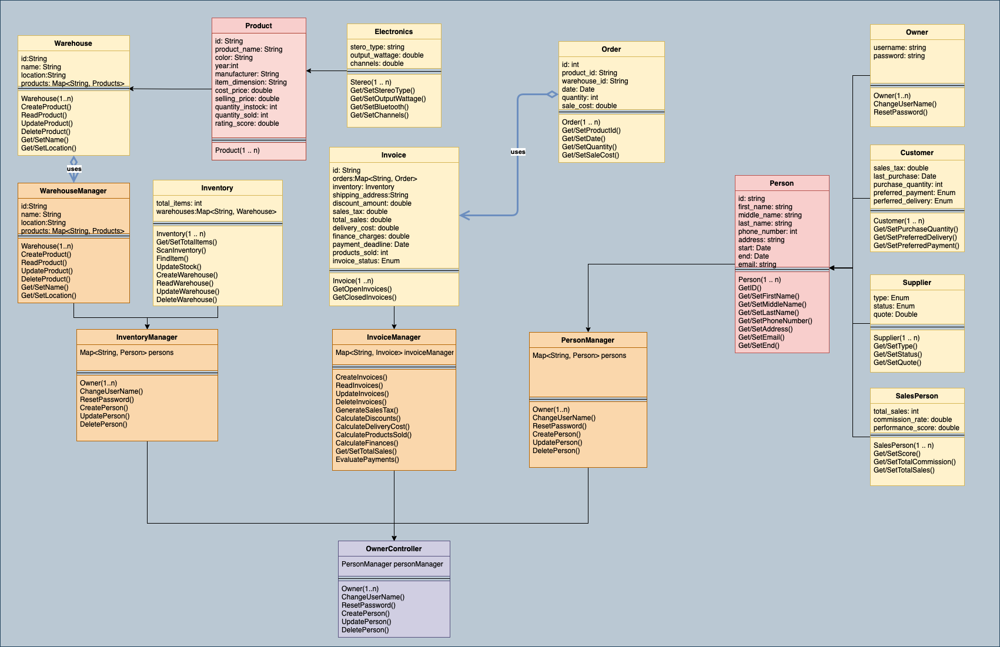

# SE03Delibird
## Advance Software Engineering

---
## Overview
This project is mainly about “Requirement Analysis” and implemention and will consist different stages to produce a partial requirements document for a given scenario based on a “proposed inventory system” detailed on a separate document.

## Background

### Request for Proposal

Hello Bidders,
       I own a small electronics store. I sell many models of TVs and stereos.  I keep these in two warehouses and replenish my stock when I have 5 or fewer items of any given model.  The number in stock is the number contained in both warehouses. I have 2 salespersons that work in my store. I pay them a commission on what they sell.  They have different commission percentages. I have many customers.  When a customer buys a product, they either take it home or I deliver it to them. I give them an invoice. They mail in checks to pay the invoice. Sometimes it takes several payment receipts to pay an invoice in full.  If they pay the invoice in full in less than 10 days, I deduct 10% from the invoice. If they don’t pay in full within 30 days, I charge a 2% finance charge. Each product has a selling price which I charge the customer. Each product has a cost price which I pay my supplier. Each customer has a sales tax % that I apply to their invoice. I don’t want to enter that for every invoice for the same customer.  The system should apply the % I assigned to the customer. If I deliver the product, I add a delivery charge to the invoice. I need to be able to add to the quantity on hand of an inventory item when I receive it from my supplier. I want a display that for each product shows me:  Product name, Selling Price, Cost Price, Total Quantity on Hand, Quantity Sold, Total Sales, Total Cost, Total Profit and Total Profit Percent.  I want this sorted in decreasing order of profit percent. I want a display that shows me the products in my inventory that have 5 or fewer in the warehouse. I want this sorted in increasing order by quantity on hand. I want a display that shows me quantity on hand for each product by warehouse. I want a display that shows me what invoices are open sorted in increasing order of invoice date. I want a display that shows me what invoices are closed (paid) sorted in decreasing order of invoice amount. I want a display that shows me the total amount of sales $$ and total commission earned for each of my salespeople. 
       
## Design

## Deployment
This project was created using maven 3.6.3 in conjunction with Java 8.

* Compile the project 
  * `mvn compile`
* Run all unit tests
  * `mvn test`
* Run a specific unit test classes
  * `mvn test -Dtest=Test1`
* Run a single test method from a test class
  * `mvn test -Dtest=Test1#methodname`
* Run multiple test classes
  * `mvn test -Dtest=Test1,Test2 `

## Implementation

### Models
* Product
  * Electronics
    * The products available with their respected advertising information
* Person
  * Owner
    * The root owner of the project entirety
  * Customer
    * The person who request sales
  * Supplier
    * The person owner request supplies
  * SalesPerson
    * The person who assists customer with product purchases
* Warehouse
  * The warehouse contains its own respected list of products available
* Inventory
  * The inventory holds all data of the entire warehouses
* Invoice
  * The invoice is a collective dataset that holds information about the entire sale.
* Order
  * The order is a singular dataset that pertains to a product and its respective parties.

### Components
* InventoryManager
  * Manages all inventory transactions
* InvoiceManager
  * Manages all invoices transactions
* WarehouseManager
  * Manages all warehouse transactions

### Controllers
* OwnerController
  * The controller that orchestrates and manages all user case transactions.

### Utils
* IdentifierUtils
  * Generates and parses unique identifer
* ExpenseUtils
  * Calcualtes expenses for all cases
* LoadUtils
  * Loads json data into objects
